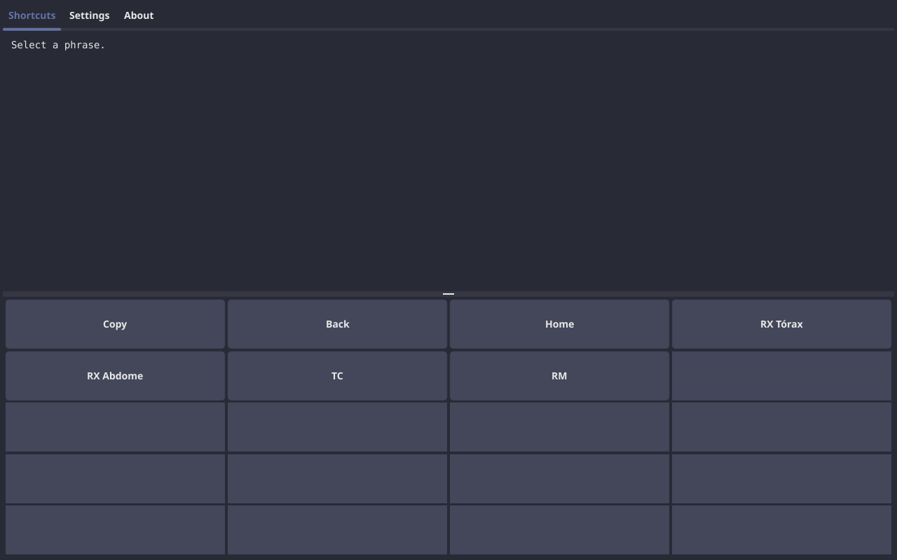

# RadKeys

Portable shortcut deck for radiology reports — copy pre-written phrases to
the clipboard without stealing focus from the RIS/PACS.



[](LICENSE)

## What it is

RadKeys is a companion app for radiologists. You connect a custom keypad
(6×6 = 36 buttons) via USB, and each button inserts a pre-written report
template. No keyboard shortcuts, no modifier keys, no focus stealing from
your RIS/PACS.

You write your report templates once in a config file. The app shows them
in a grid that mirrors your physical keypad. Press a physical button → the
phrase appears on screen → press Copy → paste into the RIS. That's it.

Works on Linux and Windows. One executable, one config file, zero install.
Everything else (icon, translations, themes) is embedded in the binary.

## Download

Get the latest release from [Releases](../../releases). Each release includes:

| File | Platform |
|------|----------|
| `radkeys-linux-amd64` | Linux x86_64 |
| `radkeys-windows-amd64.exe` | Windows x86_64 |
| `radkeys.config.toml` | Config template (all platforms) |

**macOS**: not provided (cross-compile from Linux is impossible — needs Apple's
proprietary SDK). Build from source on a Mac following the instructions below.

Put the binary and `radkeys.config.toml` in the same directory and run.

Without a hardware device, the app runs in mock mode — the UI works via mouse
clicks.

## Usage

1. Edit `radkeys.config.toml` to add your phrases. The file is heavily
   commented — a human or LLM can read it and generate a custom config
   following the rules in the comments.
2. Connect your USB device with the DIY keypad (RP2040-Zero).
3. Run RadKeys.
4. Press a text button → phrase appears in the preview.
5. Press Copy → phrase goes to the clipboard.
6. Press Paste → Ctrl+V is sent to the focused window (your RIS/PACS).
   The phrase appears at the cursor position. RadKeys never steals focus.

**Linux only:** `xdotool` must be installed for Paste to work:
`sudo apt install xdotool`

The radiologist never touches the keyboard.

## Build from source

### Prerequisites

| Dependency | Linux | Windows | macOS |
|------------|-------|---------|-------|
| **Go** 1.24+ | `sudo apt install golang-go` | [go.dev/dl](https://go.dev/dl/) | [go.dev/dl](https://go.dev/dl/) |
| **GCC** (CGO) | `sudo apt install gcc` | [MinGW-w64](https://www.mingw-w64.org/) | `xcode-select --install` |
| **Fyne** | `sudo apt install libgl1-mesa-dev xorg-dev libxxf86vm-dev` | — | — |
| **HIDAPI** | `sudo apt install libudev-dev` | — | IOKit (system) |

### Build (native)

```bash
# Linux
CGO_ENABLED=1 go build -tags flatpak -o radkeys-linux-amd64 .

# Windows (on Windows, or cross-compile from Linux with mingw)
CGO_ENABLED=1 GOOS=windows GOARCH=amd64 CC=x86_64-w64-mingw32-gcc go build -o radkeys-windows-amd64.exe .

# macOS Intel (on a Mac — cross-compile from Linux is impossible)
CGO_ENABLED=1 go build -o radkeys-macos-amd64 .

# macOS Apple Silicon (on a Mac)
CGO_ENABLED=1 GOARCH=arm64 go build -o radkeys-macos-arm64 .
```

### Cross-compile from Linux (Windows only)

```bash
sudo apt install -y gcc-mingw-w64
CGO_ENABLED=1 GOOS=windows GOARCH=amd64 CC=x86_64-w64-mingw32-gcc go build -o radkeys-windows-amd64.exe .
```

### Test

```bash
go test ./... -v
```

### Runtime dependencies (end user)

| Dependency | Linux | Windows |
|------------|-------|---------|
| **xdotool** | `sudo apt install xdotool` — required for Paste (sends Ctrl+V to RIS) | Not needed — uses Windows API natively | Not needed — uses AppleScript natively |

## Hardware

| Option | Device | Keys | Cost |
|--------|--------|------|------|
| DIY | RP2040-Zero + push buttons + 3D case | Até 36 | ~R$40-60 |

Firmware: [`firmware/rp2040-zero/`](firmware/rp2040-zero/)
Guia de montagem: [`BUILD.md`](BUILD.md)

## Configuration

All settings live in `radkeys.config.toml` (TOML, plaintext, shareable).
The file is heavily commented so a human or LLM can understand and edit
everything:
- Radiologist name, language (7 options), color theme (13 presets)
- Device VID/PID and protocol 
- Keypad layout (columns × rows)
- Screens and buttons (phrases organized in a hierarchy)

Edit the file manually — the UI's "Settings" tab only changes app settings,
not screens/buttons. To add phrases, edit the TOML file directly.

## Contributing

See [`AGENTS.md`](AGENTS.md) for AI agent rules, the dev cycle (test → tag →
CI auto-release), and project conventions.

## License

MIT — see [LICENSE](LICENSE).